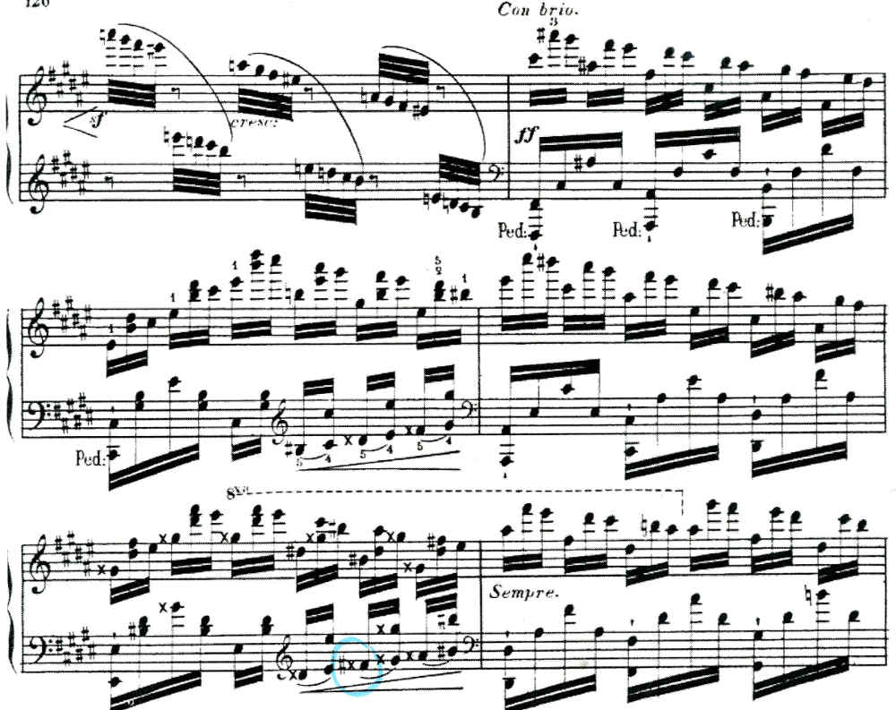
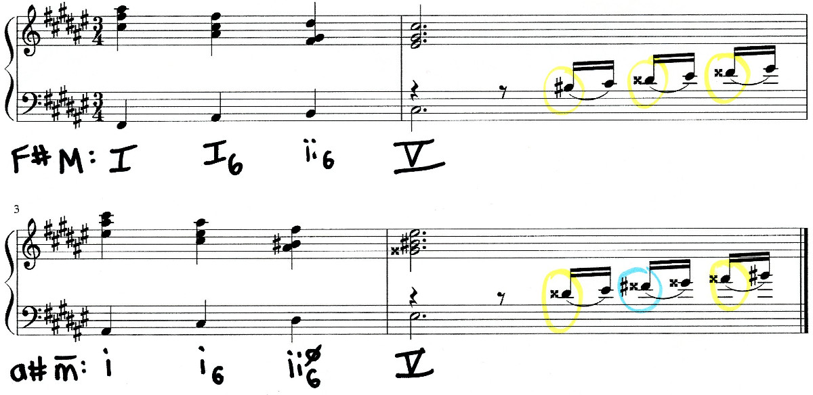

---

title: Alkan's Triple Sharp
created: 2018-07-28

tags: [music, music theory]
abstract: Here is the infamous excerpt from Charles-Valentin Alkan's Concerto for Solo Piano, Op. 39, No. 10 (mvt. 3). The triple sharp

---

### The Triple Sharp

Here is the infamous excerpt from Charles-Valentin Alkan's Concerto for Solo Piano, Op. 39, No. 10 (mvt. 3). The triple sharp is circled in blue.

Let's take a look at a simplified version of this passage.

As you can see, the harmony is not that complex. What we have here is a typical *I I6 ii6 V* progression followed by an arpeggiation of the dominant (V) chord — first in F# major, then to its mediant (iii), A# minor.
I have circled the notes that chromatically lead into the arpeggiation of the dominant.

The triple sharp is just a chromatic alteration in A# minor, scale degree #6. This *could* have been rewritten as a G#, but this would be inconsistent with the scalar pattern and harmonic rules. This is the same reason why we have an E# instead of an F in a C# major scale.

### A Deeper Analysis

It is interesting to note that the scale degree of #6 is the "farthest" one can get away from the home key.

For example, let's take the C major scale: C D E F G A B C.

If you take all the possible chromatic alterations, the possible sharp notes are C#, D#, F#, G#, A#.
We'll be omitting scale degrees 3 and 7 since those are where the half steps are, and adding a sharp would not be harmonically useful.

What do I mean by "farthest"?
By "farthest", I am referring to the order of sharps (based on the circle of 5ths), F# C# G# D# A# E# B#, where F# is "closest" and B# the "farthest".
So among the possible sharps in C major, scale degree #6, A#, is the farthest away. 

Another way to think about this is that, among all the notes of a scale, the leading tone (#7) in a scale is the farthest away from the home key. #6 would then be like the leading tone of the leading tone. Also note that the parallel minor, although 3 sharps "fewer" than its parallel major, can also utilize #6 because minor keys often use the same leading tone.

Thus, taking a scale that has the most sharps (A# minor) and using the chromatic alteration that is the farthest away, will get you around the circle just enough to require a triple sharp. Neat, right?

And here is the excerpt of the piece:

 

<iframe width="560" height="315" src="https://www.youtube.com/embed/ne7XYi1i5l0?start=507" frameborder="0" allow="autoplay; encrypted-media" allowfullscreen></iframe>

