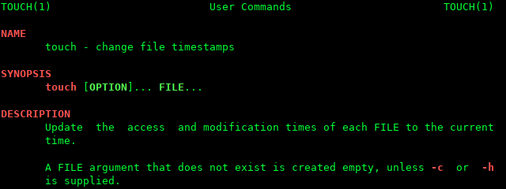

---

title: "You're doing it wrong: unix tools"
created: 2019-01-02

tags: [tech, linux]

---

### Introduction: curl and wget

Most developers know that **curl** has more features than **wget**, but for any
task involving downloading files, wget seems to be the most popular.
Why is that?

Well, it really boils down to the defaults. While the author of curl has
[explained](https://daniel.haxx.se/blog/2014/11/17/why-curl-defaults-to-stdout/)
his design choice, curl defaults to *printing to stdout* whereas wget defaults to
*saving to a file*. Naturally, people will take the path of least resistance, and
prefer `wget` over `curl -O`.

I bring this example up because, despite the intentions of the authors, users
tend to use the tools in whatever way works best for them.

### Touch

According to the man page, **touch**'s main purpose is to *change file timestamps*.
When was the last time you used it that way? I can confidently say in my decade
and a half of using unix tools, I have only had to do that **once** (and it was
for a shell programming homework assignment).

Under "description" in the man page, it says:

`Update the access and modification times of each FILE to the current time.`

and then

`A FILE argument that does not exist is created empty, unless -c or -h is supplied.`

Aha! Interesting that what seems like just a side effect (creating an empty
file) has become the most common use case.

### Cat

It is conventional wisdom that **cat** is used to print out files to
stdout because cat stands for...con**cat**enate? Huh?

Imagine you were to write a function that takes in strings and returns the
concatenation of all of them. A mindful developer would take into account *any*
number of inputs, including zero and one input, but a beginner (or
lazy) developer might not. From this problem description, it would seem like
inputs of zero or one strings are **edge cases**.

Strange how for **cat**, concatenating *one* file is its primary use case!

The man page for cat says it will *concatenate files and print on the standard
output*. However, most people use it to simply print the contents of *one* file
to stdout, which has led to using cat to chain commands,
e.g. `cat file | grep "hi"`.

This idiom is so common that people have even written about
the [Useless Use of Cat](https://en.wikipedia.org/wiki/Cat_(Unix)#Useless_use_of_cat)
and the [Useless Use of Cat Award](http://porkmail.org/era/unix/award.html)!

### Conclusion

Despite the title of this post, I think it's perfectly fine to use the tools in
anyway you need. In fact, I would say these tools are the easiest to use for
the functions I've mentioned above (which I use all the time). I just
find it quite fascinating to see how in both **touch** and **cat**, the intended use
has been neglected (or even forgotten) because of a more useful side effect.

In the case with **cat**, I find there are benefits with the "useless" use.
Conceptually, chaining simple commands through pipes is much easier than
remembering which argument is for the input file. Also, when building a more
complicated command, I like to visually see the output step-by-step. And with
the only con being...spawning an extra process? It's okay, I'll stick with my
current
[workflow](https://xkcd.com/1172/) :)
